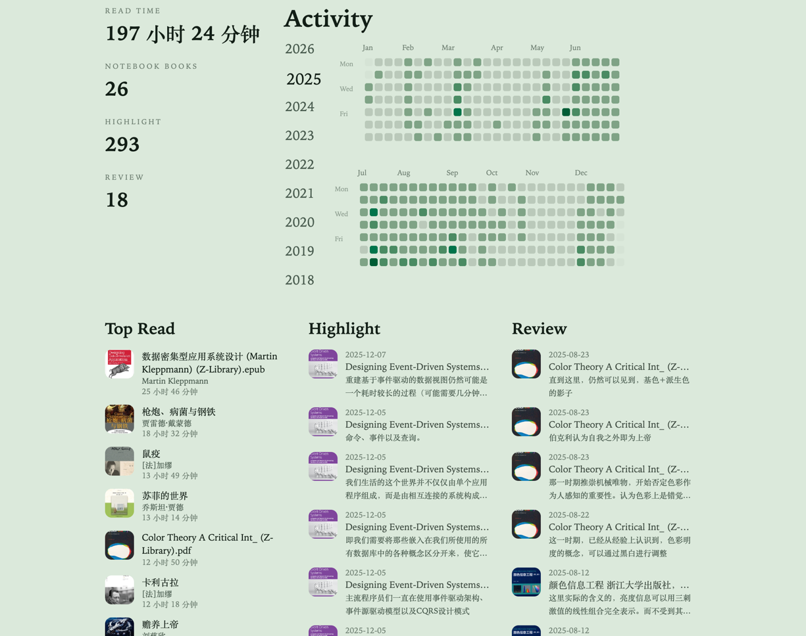
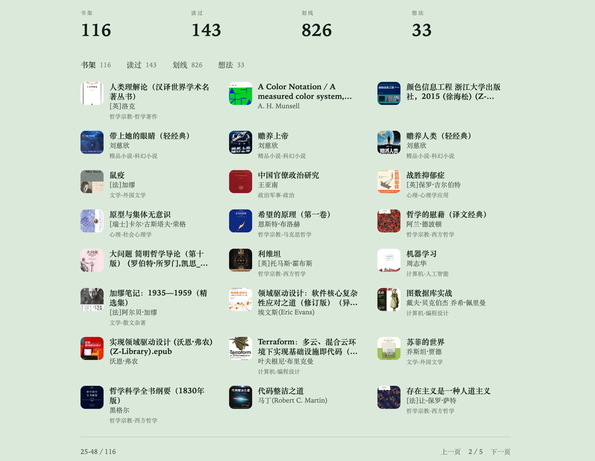
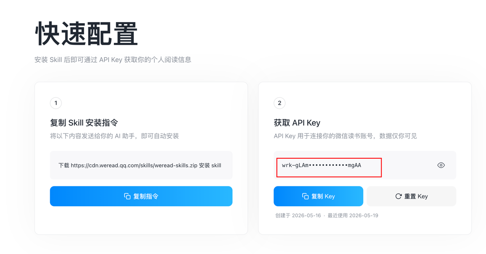

# wereto

基于微信读书 [weread-skills](https://weread.qq.com/r/weread-skills) 创建的阅读数据页，支持 cloudflare 一键部署。




## 一键部署 
[](https://deploy.workers.cloudflare.com/?url=https://github.com/ktKongTong/wereto)

部署完成后，可进入页面进行配置，默认密码为 `wereto`(首次登录后，请务必更新）.

在 [weread-skills](https://weread.qq.com/r/weread-skills) 获取 Weread APIKey



在配置页面进行保存，随后即可在同步页面进行首次全量同步，同步完成后即可见到数据

## 其他功能
- 定时增量同步
-  api 支持，适合接入个人博客页面(`x-api-key` header)

```
`/api/recent/read`，最近阅读书籍
/api/recent/annotation，最近划线/评论/想法
```

## 已知问题

在部分情况下，weread API 提供的数据并非与文档所说的完全一致。

例如作者本人的 apikey 在 2023 的年度数据中，无法获取到 readLongest。 因此会出现数据缺失的情况。

### credit

inspired by: https://github.com/gabehf/Koito
